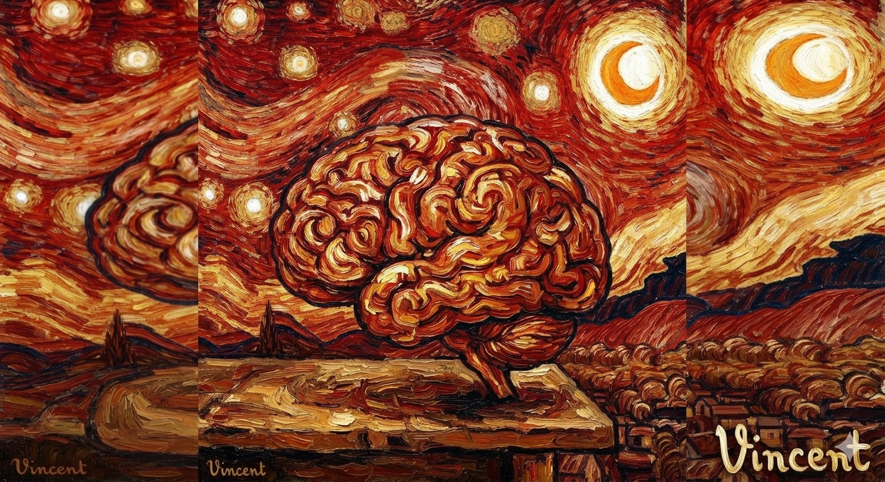

# Kernel Neuromórfico



## PNLIO — Kernel Neuromórfico Experimental v10.1

**Autor:** Gonzalo Mauricio de la Rivera Arellano (Comandante Godear24)  
**Homenaje:** En memoria eterna de Don Héctor de la Rivera Urrutia (2023–2026). Este proyecto es un acto de soberanía y memoria.

---

### 📌 Descripción del Proyecto
El **Kernel Neuromórfico PNLIO** es un motor experimental basado en **Spiking Neural Networks (SNN)** que utiliza modelos de neuronas *Leaky Integrate-and-Fire* (LIF), dinámicas de aprendizaje local STDP (*Spike-Timing-Dependent Plasticity*), homeostasis adaptativa y modulación de campos theta/emocionales en tiempo real.

El sistema integra la **VÍA B** (Vector 1932), un amplificador emocional que orienta la resonancia cognitiva del kernel para la toma de decisiones y la interacción con modelos de lenguaje.

### 🚀 Instalación y Uso

#### Requisitos
- Python 3.10+
- Ollama (con modelo `qwen2.5:14b` o similar)

#### Configuración
1. Clonar el repositorio:
   ```bash
   git clone https://github.com/godear6959-creator/kernel-neuromorfico.git
   cd kernel-neuromorfico
   ```
2. Instalar dependencias:
   ```bash
   pip install -r requirements.txt
   ```

#### Ejecución del Kernel
Para iniciar el servidor API (FastAPI):
```bash
python main_v10.py
```

### 🛠️ Estructura del Repositorio
- `pnlio.py`: Módulo del Analizador de Coherencia (extraído de la especificación técnica).
- `main_v10.py`: Núcleo del kernel neuromórfico v10.1 con integración API.
- `docs/`: Documentación técnica, incluyendo el tratado de coherencia en LaTeX y guías de descarga.
- `assets/`: Recursos visuales y diagramas del cerebro vivo.
- `examples/`: Scripts de ejemplo para evaluar diálogos y detectar el **Efecto Reflex**.
- `legacy/`: Archivos históricos o de otros módulos (FERMIER).

### 📡 Endpoints de la API
- `GET /homenaje`: Información sobre el autor y el origen del proyecto.
- `POST /run`: Procesa un prompt a través del kernel neuromórfico y genera una respuesta vía Ollama.

### ⚖️ Licencia y Atribución
Este proyecto se distribuye bajo la licencia MIT. Se debe mantener siempre la atribución a **Gonzalo Mauricio de la Rivera Arellano** como creador y descubridor del concepto de PNL Inversa Ontológica.

---
*Integridad Ontológica Asegurada | Vector 1932*
