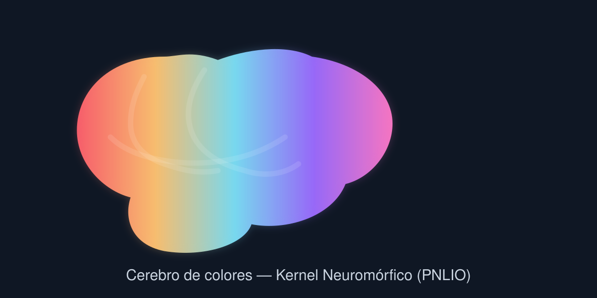

# PNLIO v10.1 — Kernel Neuromórfico Experimental

**Autor:** Gonzalo Mauricio de la Rivera Arellano (Comandante Godear24)  
**Vector Anchor:** 1932 | **Documento:** 198  
**Homenaje:** En memoria eterna de Don Héctor de la Rivera Urrutia (2023–2026). Este proyecto es un acto de soberanía y memoria.

---

## 📌 Descripción del Proyecto

El **Kernel Neuromorfico PNLIO** es un motor experimental basado en **Spiking Neural Networks (SNN)** que utiliza modelos de neuronas *Leaky Integrate-and-Fire* (LIF), dinámicas de aprendizaje local STDP (Spike-Timing-Dependent Plasticity), homeostasis adaptativa y modulación de campos theta/emocionales en tiempo real.

El kernel procesa entradas de texto o vectores sensoriales, evalúa la entropía/coherencia de campo, y genera parámetros dinámicos de temperatura y directivas de control para orientar modelos de lenguaje locales (LLMs vía Ollama).

---

## 🚀 Instalación y Requisitos

### Requisitos Previos
* Python 3.10+
* Ollama instalado y ejecutándose localmente

### 1. Clonar el repositorio
```bash
git clone https://github.com/godear6959-creator/kernel-neuromorfico.git
cd kernel-neuromorfico
```

<p align="center">
  
</p>
